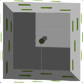

<h1 align=center> ENPM808X Final Project </h1>

<p align="center">

[](https://travis-ci.org/hrishikeshtawade04/the_inspector)
[](https://coveralls.io/github/hrishikeshtawade04/the_inspector?branch=master)
[](https://opensource.org/licenses/BSD-3-Clause)

</p>

<h1 align=center> The Inspector </h1>

<p align="center">

</p>

## Project Overview
The Inspector by Acme Robotics is one of there flagship products. It has the following features;

- Turtlebot navigates in a mapped environment towards the ideal positions in front of wall to detect the leakages.
- Stores picture of walls having leakage and gives positions of leakage on the wall.

## Presentation
- Presentation slides [TODO]()
- Presentation Video - Presentation [TODO]()|Building packages [TODO]()| Demo [TODO]() |Saving the map [TODO]().

## License
This project is under the [BSD License](https://github.com/hrishikeshtawade04/the_inspector/blob/master/LICENSE).

## Agile Development
This product for Acme Robotics has is been developed by following the Solo Iterative Process (SIP), which a agile development process. You can take a look at the log details by going on this [LINK](https://docs.google.com/spreadsheets/d/1YTPVK5r-ZWE2yvQfAulh54kC3Dr284mhhSaxrUf1OMI/edit?usp=sharing).

Planning notes are given in this [LINK](https://docs.google.com/document/d/1v37j9J9pUYrncYB3P4gCmah4dpz-IAK4ekfOWanukgU/edit).

## Authors
- Hrishikesh Tawade [Github](https://github.com/hrishikeshtawade04).
- Kapil Rawal [Github](https://github.com/krawal19).

## Personnel
##### Hrishikesh Tawade
- Robotics Graduate Student at University of Maryland offered by the Office of Advanced Engineering Education in the A. James Clark School of Engineering.
- Fields of interest are Computer Vision and Deep Learning.

##### Kapil Rawal
- Robotics Graduate Student at University of Maryland offered by the Office of Advanced Engineering Education in the A. James Clark School of Engineering.
- Fields of interest Autonomous Micro-Aerial Vehicles.
- Hobbies: Photography

## Dependencies
The Inspector requires following dependencies.
- ROS Kinetic kame
- Turtlebot ROS packages
- Gazebo 7.x
- Turtlebot Gazebo packages
- Rviz (Optional)
- Mapserver
- Googletest
- OpenCV
- Ubuntu 16.04

## Dependencies Installations

- To Install ROS Kinetic Kame, follow the instructions in this link [LINK](http://wiki.ros.org/kinetic/Installation/Ubuntu).

- To install Turtlebot simulation stack type, run the following after installing ROS Kinetic on your ubuntu 16.04.
```
$ sudo apt-get install ros-kinetic-turtlebot-gazebo ros-kinetic-turtlebot-apps ros-kinetic-turtlebot-rviz-launchers
```

- To Install Gazebo 7.x follow this link  [LINK](http://gazebosim.org/tutorials?tut=install_ubuntu&ver=7.0).

- To Install OpenCV follow this link [LINK](https://github.com/kyamagu/mexopencv/wiki/Installation-(Linux,-Octave,-OpenCV-3).

- You can install Google Test Framework by going on this  [LINK](https://www.eriksmistad.no/getting-started-with-google-test-on-ubuntu/).
We are using google test frame work for testing of our classes and their methods.

- To install map_server use the folllowing commands
```
$ sudo apt-get install ros-kinetic-map-server
```
- To install Rviz go through this link [LINK](http://wiki.ros.org/rviz/UserGuide).

## Operation
The Inspector Robot module has 3 sub modules

##### 1) Path Planning Module
This module deals with turtlebot's pathplanning and navigation. The features of this module are,
- Finding current location of turtlebot with respect to world.
- Kepping a record of next location to move.
- Moving to desired angles with accuracy of 1.0 degree.
- Moving to desired coordinates with accuracy of 0.1 meters
- Handling of undesired readings from sensors.

##### 2) Image Processing Module
This module deals with processing of images clicked by turtlebot's asus xtin pro camera.
- This module can click pictures of the environment anytime.
- It can store the images in any desired folder.
- It can detect contoursof green patches on a blue wall.

##### 3) Robot module
This module deals with running the Path Planning Module and Image Processing Module in tandam to find leakages on 4 walls.
- This module can take in the dimensions of the map of the infrastructute and calculate the positions where the robot should go and take images based on the turtlebot's camera field of view.
- It prints the leakage locations on the screen.
- It prints the total number of leakages on the screen.

## Leakage Detection Output Flow
The following process will guide you through the complete process of leakage.

### Finding Wall Contours
From wall coutours we can calculate the scaling factor in terms of pixel/meter between the seen dimensions of wall and actual dimensions of wall. We starts as follows:
#### 1) GrayScaling Wall Image
Gray scaling of the wall image converts the image from 3 vector image to a single vector image. It is done using following code line.
```
cv::cvtColor(imageLeakage, grayImage, CV_BGR2GRAY);
```
The image after gray scale is as follows.
<p align="center">

</p>
<p align="center">

#### 2) Thresholding Grayscale Image
By thresholding we subtract the ground and the sky seen in the image. It could be seen in below code. Also we invert the binary image so that only the wall is white and rest all is black.
```
cv::threshold(grayImage, threshY, 125, 255, cv::THRESH_BINARY_INV);
```
The image after thresholding is as follows.
<p align="center">

</p>
<p align="center">

#### 3) Finding Countours of the Wall
Now we feed this image to the countour finding algorithm which then generates the coordinates of the wall in terms of pixels. It can be seen from below code.
```
cv::findContours(threshY, contours, hierarchy, CV_RETR_TREE,
                       CV_CHAIN_APPROX_SIMPLE, Point(0, 0));
```
The image after finding countour is as follows.
<p align="center">

</p>
<p align="center">

### Finding Leakage Contours
This process has lot more processing since we need this to be robust.The process is as follows.
#### 1) HSV conversion of Wall Image
HSV plane conversion let us detect features in image irrespective of change in lighting conditions.Since we are testing the robot with a wall in dark this was important. The code is below.
```
cv::cvtColor(imageLeakage, hsvImage, cv::COLOR_BGR2HSV);
```
The image after converting to HSV is as follows.
<p align="center">

</p>
<p align="center">

#### 2) Creation of mask to find leakages
The mask is created so that we can then use it to highlight the leakage patches from the image. The code is below.
```
cv::inRange(hsvImage, lowGreen, highGreen, greenMask);
```
The image of mask is as follows.
<p align="center">

</p>
<p align="center">

#### 3) Bitwise AND of HSV and Mask
The bitwise AND operation will extract the patches from the HSV image. The code is below.
```
cv::bitwise_and(hsvImage, hsvImage, bitwiseImage, greenMask);
```
The image after this operation is as follows.
<p align="center">

</p>
<p align="center">

#### 4) Converting to Grayscale
Now we follow the same process as we did to find countour of wall. So we first convert the obtained image into grayscale. The code is below.
```
cv::cvtColor(bitwiseImage, gryImage, CV_BGR2GRAY);
```
The image of grayscale is as follows.
<p align="center">

</p>
<p align="center">

#### 5) Thresholding GrayScale Image
This will remove the background of the image and will keep only the patches in binary format. The code is below.
```
cv::threshold(gryImage, threshImage, 40, 255, cv::THRESH_BINARY);
```
The image of grayscale is as follows.
<p align="center">

</p>
<p align="center">

#### 6) Finding Countours of Leakages
This will find the leakage countours coordinates which then we convert into the actual world coordinates with respect to the wall.
```
cv::findContours(threshImage, contours, hierarchy, CV_RETR_TREE,
                       CV_CHAIN_APPROX_SIMPLE, Point(0, 0));
```
The image of grayscale is as follows.
<p align="center">

</p>
<p align="center">

## Program installation
```
$ mkdir -p ~/catkin_ws/src
$ cd ~/catkin_ws/
$ catkin_make
$ source devel/setup.bash
$ cd src/
$ git clone --recursive https://github.com/hrishikeshtawade04/the_inspector.git
$ cd ..
$ catkin_make
```
## Instructions to run program (DEMO)

To run the program first open a new terminal window and run following commands.
```
$ rosclean purge
$ cd <path to catkin_ws>
$ source devel/setup.bash
$ roslaunch the_inspector the_inspector.launch
```
>[NOTE: Make sure to run the source command otherwise the launch file won't detect the package. Also you will see **warnings** which our package will output, on the screen till gazebo is launched completely]

You can also launch the .world  in the World folder spearatelyNow when the world opens up run the following commands to run 'the_inspector' node. Running both of them together

```
$ cd <path to catkin_ws>
$ source devel/setup.bash
$ cd <data folder in the_inspector>
$ rosrun the_inspector the_inspector
```
We are running the code in data folder because the images of the leakages can then be stored in data. The images will automatically get stored to the folder from where you run the rosrun command.

## Running ROS test via command-line
The test is written using gtest and rostest. Close all the running processes before executing the commands below to run the rostest.
```
$ cd <path to catkin Workspace>
$ source devel/setup.bash
$ catkin_make run_tests
```
Or test using launch file
```
$ cd <path to catkin Workspace>
$ source devel/setup.bash
$ rostest the_inspector inspect.launch
```
This will run the gazebo headless.

>[NOTE:  The tests take over **4 minutes** to run completely since the test modules cover rigorous testing of all software modules for all the boundary conditions and even exceptions from sensor readings. So patience is appreciated !]

## Coverage

The local code coverage can be found the results section in the localCoverage folder. If you desire to generate it, following commands can run.
```
$ cd <path to catkin Workspace>
$ cd build
$ lcov --directory . --capture --output-file coverage.info
```
To create an html file of the local coverage, run the below command. It will create a `covout` folder in build folder wherein you can double-click on the `index.html` file which will open the graphical local coverage file in your default browser.
```
$ cd <path to catkin Workspace>
$ genhtml coverage.info --output-directory covout
```
Now to output the coverage of each file in the terminal use the command below
```
$ cd <path to catkin Workspace>
$ lcov --list coverage.info
```

## Record rosbag

To record rosbag you need to run the following

```
roslaunch the_inspector the_inspector.launch enableBag:=true
```

This will record a rosbag file named storedInspectorData.bag into the results directory of this package for 15 seconds.

>[NOTE: This launch file will not record camera data, like RGB images and depth images, because the file size will become too large too quickly. If camera data is needed, rosbag will have to be run separately in another terminal.]

## Playback of rosbag

To play the recorded data follow the instructions below in anew terminal after starting a roscore command in a new terminal.

```
cd <path to repository>/results
rosbag play storedInspectorData.bag
```

>[NOTE: Gazebo should not be running when playing back with rosbag.]

## Doxygen Documentation

Although the repository contains the documentation, if you'd still like to generate it then follow the instructions below.

Install doxygen using below commands
```
sudo apt-get install doxygen
sudo apt-get install doxygen-gui
```
After installation run following command to open the doxywizard wherein you can fill in the details as required and set the source code folder to the repository as well. Create a new folder in the repository and select that as the destination directory. Add paths to include and src folders and then proceed with the default settings and generate the documentation.
```
doxywizard
```
